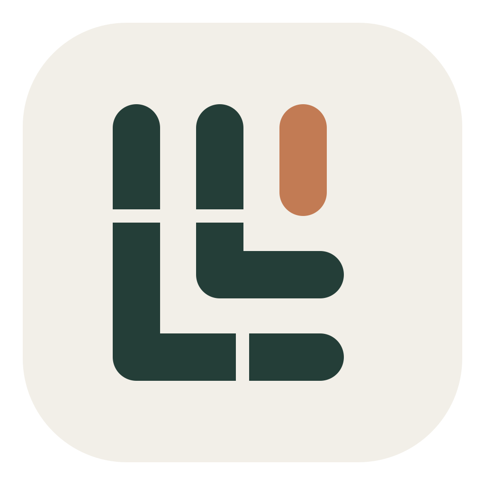

# Design Loom



A local design workspace that turns reusable components and design systems into a versioned, editable product workflow.

Design Loom is an **independent fork of [OpenDesign](https://github.com/nexu-io/open-design)**, maintained in [this repository](https://github.com/linghaoSu/open-design). It has its own desktop application, protocol, runtime namespace and update policy. It can run beside an existing OpenDesign installation.

[简体中文](docs/i18n/README.zh-CN.md) · [Using Design Loom](docs/design-loom.md) · [Design system guide](docs/structured-design-runtime.md) · [Architecture](docs/architecture.md)

## What you can do

- Browse the entire project in a file tree, then preview and edit its artifacts.
- Preview JSX/TSX components, infer temporary prop values, and change props while debugging.
- Register reusable React/TypeScript and Vue components with explicit production code bindings.
- Compose semantic screens and shared component instances; review affected screens before publishing changes.
- Migrate an existing design system into an immutable package, preserving source evidence and original assets.
- Lock exact system versions, review upgrades and continue editing from an explicit package baseline.
- Validate Guided and Strict generation through the daemon and the same public CLI operations.

The [runtime guide](docs/structured-design-runtime.md) documents supported source forms and diagnostics. Legacy HTML remains useful visual evidence; migration prompts explain the work required to turn it into reusable code components.

## Run locally

Use Node 24 and the Corepack-pinned pnpm version. Set an isolated `OD_DATA_DIR` before starting a development runtime; follow the [daemon data directory contract](AGENTS.md#daemon-data-directory-contract). A namespace alone does not isolate daemon data.

```sh
corepack pnpm install --frozen-lockfile
: "${OD_DATA_DIR:?Set an isolated daemon data root before starting Design Loom}"
corepack pnpm tools-dev start desktop --namespace design-loom-dev
```

Use `tools-dev status`, `logs`, `stop` and `restart` with the same namespace. Do not run a development daemon against an installed application's data.

## Build the independent macOS app

```sh
corepack pnpm tools-pack mac build --namespace design-loom --portable --to dmg --app-version 0.1.0-beta.1 --json
corepack pnpm tools-pack mac install --namespace design-loom --app-version 0.1.0-beta.1 --json
corepack pnpm tools-pack mac start --namespace design-loom --app-version 0.1.0-beta.1 --json
```

The installer contains **Design Loom.app** with a distinct bundle identity. Tool-managed installation uses its own namespace. The fork does not register OpenDesign's OS protocol or replace its global `od` command, import its runtime data automatically, or install updates from the upstream feed. In-repository package names, API paths and the `od design-runtime` command remain compatible.

See [Using Design Loom](docs/design-loom.md) for the verified installation and migration workflow. Local packaging is separate from a signed and notarized public release.

## Development checks

```sh
corepack pnpm guard
corepack pnpm typecheck
```

Tests are package-scoped. Follow [AGENTS.md](AGENTS.md), the relevant directory guidance and the [delivery plan](specs/current/structured-design-runtime.md).

This project develops independently. Pushes and changes target this fork; no upstream pull request or merge is part of its delivery workflow. Third-party services such as OpenDesign Cloud retain their original provider names.

## Acknowledgements and license

Design Loom builds on OpenDesign by Nexu Labs and its contributors. Existing attribution and license notices are retained. The repository remains licensed under [Apache 2.0](LICENSE).
